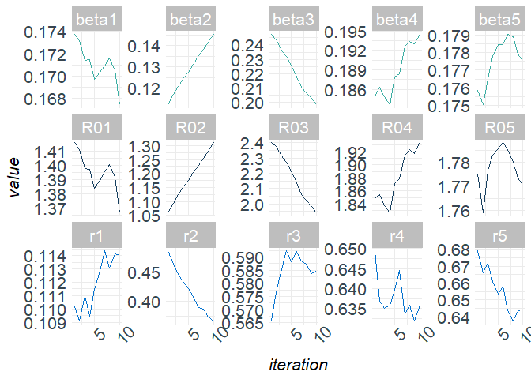
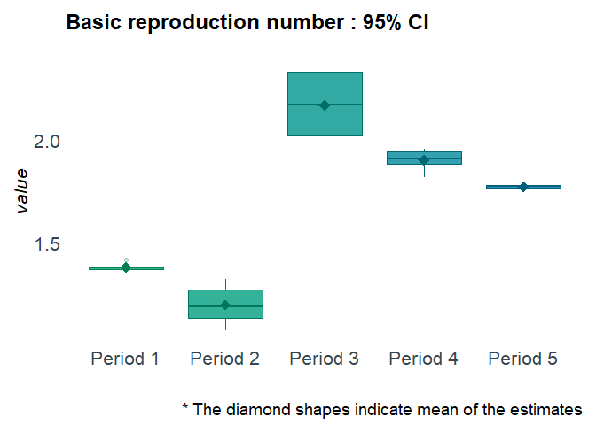
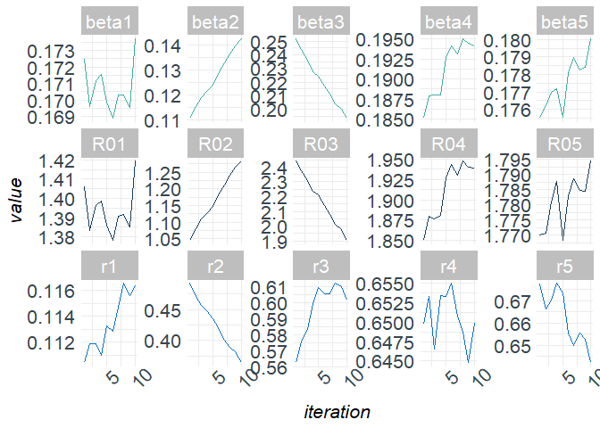
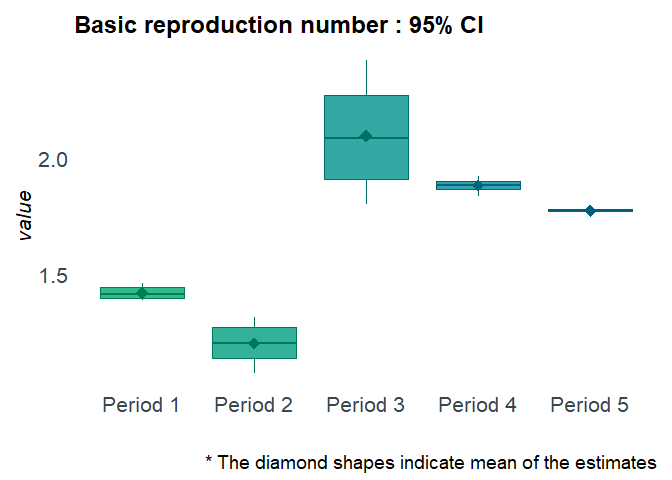
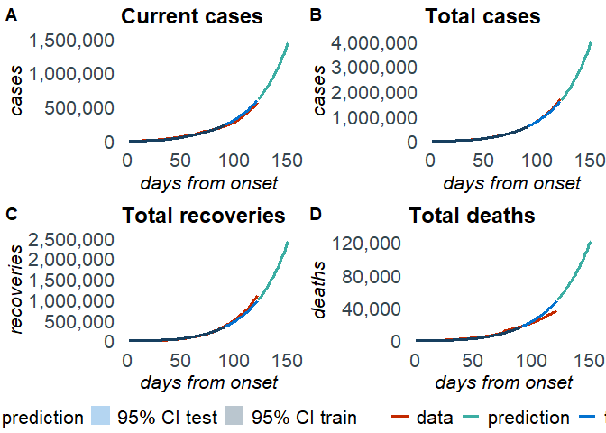
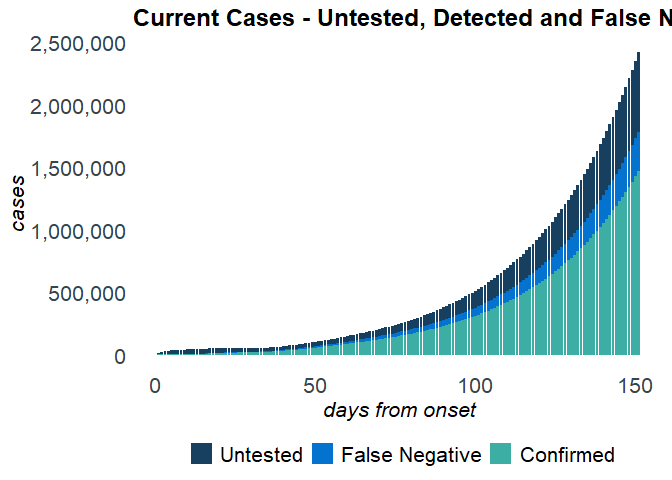

<!-- README.md is generated from README.Rmd. Please edit that file -->

# R package `SEIRfansy`

# Extended Susceptible-Exposed-Infected-Recovery Model

[](https://github.com/umich-biostatistics/SEIRfansy)
[](https://github.com/umich-biostatistics/SEIRfansy)
[](https://doi.org/https://doi.org/10.1101/2020.09.24.20200238)

## Overview

This `R` package fits Extended Susceptible-Exposed-Infected-Recovery
(SEIR) Models for handling high false negative rate and symptom based
administration of diagnostic tests.

## Installation

If the devtools package is not yet installed, install it first:

``` r
install.packages('devtools')
```

``` r
# install SEIRfansy from Github:
devtools::install_github('umich-biostatistics/SEIRfansy') 
```

Once installed, load the package:

``` r
library(SEIRfansy)
#> Registered S3 methods overwritten by 'car':
#>   method                          from
#>   influence.merMod                lme4
#>   cooks.distance.influence.merMod lme4
#>   dfbeta.influence.merMod         lme4
#>   dfbetas.influence.merMod        lme4
```

## Example Usage

For this example, we use the built-in package data set `covid19`, which
contains dailies and totals of cases, recoveries, and deaths from the
COVID-19 outbreak in India from January 30 to September 21 of 2020.

### Setup

You will need the `dplyr` package for this example.

``` r
library(dplyr)
#> 
#> Attaching package: 'dplyr'
#> The following objects are masked from 'package:stats':
#> 
#>     filter, lag
#> The following objects are masked from 'package:base':
#> 
#>     intersect, setdiff, setequal, union
```

Training data set:

For training data, we use cases from April 1 to June 30

``` r
train = covid19[which(covid19$Date == "01 April "):which(covid19$Date == "30 June "),]
```

Testing data set:

For testing data, we use cases from July 1 to July 31

``` r
test = covid19[which(covid19$Date == "01 July "):which(covid19$Date == "31 July "),]
```

Data format for multinomial and Poisson distribution:

``` r
train_multinom = 
  train %>% 
  rename(Confirmed = Daily.Confirmed, 
         Recovered = Daily.Recovered,
         Deceased = Daily.Deceased) %>%
  dplyr::select(Confirmed, Recovered, Deceased)

test_multinom = 
  test %>% 
  rename(Confirmed = Daily.Confirmed, 
         Recovered = Daily.Recovered,
         Deceased = Daily.Deceased) %>%
  dplyr::select(Confirmed, Recovered, Deceased)

train_pois = 
  train %>% 
  rename(Confirmed = Daily.Confirmed) %>%
  dplyr::select(Confirmed)
```

Initialize parameters:

``` r
N = 1341e6 # population size of India
data_initial = c(2059, 169, 58, 424, 9, 11)
pars_start = c(c(1,0.8,0.6,0.4,0.2), c(0.2,0.2,0.2,0.25,0.2))
phases = c(1,15,34,48,62)
```

## SEIRfansy()

If interest is in model estimation but not prediction, then use
`SEIRfansy()`. Otherwise, use `SEIRfansy.predict()` (see below).

``` r
?SEIRfansy
```

``` r
cov19est = SEIRfansy(data = train_multinom, init_pars = pars_start, 
                     data_init = data_initial, niter = 1e3, BurnIn = 1e2, 
                     model = "Multinomial", N = N, lambda = 1/(69.416 * 365), 
                     mu = 1/(69.416 * 365), period_start = phases, opt_num = 1, 
                     auto.initialize = TRUE, f = 0.15)
#> Finding MLE
#> 1 MLE run finished!
#>  
#> MLE estimates : 
#> beta = ( 0.18, 0.1, 0.25, 0.18, 0.18 )
#> r = ( 0.112, 0.531, 0.544, 0.65, 0.688 )
#>  
#> MCMC:
#> Iter 100  A = 0  :  0.1772 0.1095 0.2517 0.1817 0.1749 0.1116 0.5091 0.5628 
#> 0.6397 0.6707
#> Iter 200  A = 4e-04  :  0.1737 0.1133 0.2494 0.1829 0.1758 0.1117 0.4871 0.573 
#> 0.6399 0.6686
#> Iter 300  A = 0.0026  :  0.1695 0.1169 0.2439 0.1847 0.177 0.1089 0.4676 0.5837 
#> 0.6392 0.668
#> Iter 400  A = 9.7852  :  0.1669 0.1206 0.2406 0.189 0.1753 0.1101 0.4521 0.5945 
#> 0.6368 0.6587
#> Iter 500  A = 0  :  0.1677 0.1241 0.232 0.1904 0.1777 0.1121 0.4379 0.597 
#> 0.6393 0.652
#> Iter 600  A = 0  :  0.1688 0.1271 0.2261 0.19 0.1775 0.1147 0.4269 0.5992 
#> 0.6358 0.6582
#> Iter 700  A = 0  :  0.1698 0.1299 0.2167 0.1931 0.1774 0.1163 0.4169 0.5985 
#> 0.6415 0.6561
#> Iter 800  A = 96.4675  :  0.1682 0.134 0.2131 0.1941 0.1767 0.1155 0.4023 
#> 0.6021 0.6432 0.6468
#> Iter 900  A = 0  :  0.1666 0.1409 0.2037 0.1955 0.178 0.1165 0.3833 0.5982 
#> 0.6422 0.6415
#> Iter 1000  A = 0  :  0.1684 0.1432 0.1976 0.196 0.1792 0.1176 0.3724 0.5994 
#> 0.6399 0.6398
#> Iter 1100  A = 4e-04  :  0.169 0.1467 0.1945 0.1969 0.1791 0.1154 0.3597 0.5875 
#> 0.6358 0.6282
```

Inspect the results:

``` r
names(cov19est)
class(cov19est$mcmc_pars)
names(cov19est$plots)
```

Plot the results:

``` r
plot(cov19est, type = "trace")
```

<!-- -->

``` r
plot(cov19est, type = "boxplot")
```

<!-- -->

## SEIRfansy.predict()

If interest is in model estimation and prediction, then use
`SEIRfansy.predict()`, which first runs `SEIRfansy()` internally, and
then predicts.

``` r
?SEIRfansy.predict
```

``` r
cov19pred = SEIRfansy.predict(data = train_multinom, init_pars = pars_start, 
                              data_init = data_initial, T_predict = 60, niter = 1e3, 
                              BurnIn = 1e2, data_test = test_multinom, model = "Multinomial", 
                              N = N, lambda = 1/(69.416 * 365), mu = 1/(69.416 * 365), 
                              period_start = phases, opt_num = 1, 
                              auto.initialize = TRUE, f = 0.15)
#> Estimating ... 
#>   
#> Finding MLE
#> 1 MLE run finished!
#>  
#> MLE estimates : 
#> beta = ( 0.18, 0.1, 0.25, 0.18, 0.18 )
#> r = ( 0.112, 0.531, 0.544, 0.65, 0.688 )
#>  
#> MCMC:
#> Iter 100  A = 0  :  0.176 0.1073 0.2544 0.1814 0.1747 0.11 0.5132 0.5471 0.6516 
#> 0.6921
#> Iter 200  A = 1.683785e+12  :  0.1725 0.1105 0.2518 0.1851 0.1755 0.1104 0.4926 
#> 0.5624 0.6498 0.6774
#> Iter 300  A = 0  :  0.1696 0.1153 0.2439 0.1879 0.1762 0.1119 0.4711 0.5755 
#> 0.6533 0.6663
#> Iter 400  A = 0  :  0.1712 0.1188 0.2364 0.188 0.177 0.1119 0.4573 0.5834 
#> 0.6465 0.6702
#> Iter 500  A = 0  :  0.1715 0.1215 0.2279 0.188 0.1772 0.111 0.4472 0.5995 
#> 0.6534 0.6777
#> Iter 600  A = 498.6388  :  0.1699 0.1239 0.2246 0.1926 0.1756 0.1132 0.435 
#> 0.6094 0.6533 0.6732
#> Iter 700  A = 0.0217  :  0.1689 0.1283 0.2174 0.1941 0.1781 0.1128 0.4204 
#> 0.6056 0.655 0.6553
#> Iter 800  A = 407.4618  :  0.1703 0.1327 0.2114 0.1931 0.179 0.1147 0.4011 
#> 0.6058 0.6508 0.6497
#> Iter 900  A = 1947.649  :  0.1703 0.1363 0.2038 0.195 0.1782 0.1166 0.3894 
#> 0.6122 0.6487 0.6557
#> Iter 1000  A = 0  :  0.1696 0.1394 0.2005 0.1945 0.1784 0.1156 0.3812 0.61 
#> 0.6448 0.6528
#> Iter 1100  A = 0  :  0.1737 0.1424 0.1936 0.1941 0.18 0.1164 0.3638 0.6017 
#> 0.6499 0.6422
#>  
#> Predicting ...
```

Inspect the results:

``` r
names(cov19pred)
class(cov19pred$prediction)
class(cov19pred$mcmc_pars)
names(cov19pred$plots)
```

Plot the results:

``` r
plot(cov19pred, type = "trace")
```

<!-- -->

``` r
plot(cov19pred, type = "boxplot")
```

<!-- -->

``` r
plot(cov19pred, type = "panel")
```

<!-- -->

``` r
plot(cov19pred, type = "cases")
```

<!-- -->

### Current Suggested Citation

Ritwik Bhaduri, Ritoban Kundu, Soumik Purkayastha, Mike Kleinsasser,
Lauren J Beesley, Bhramar Mukherjee. “EXTENDING THE
SUSCEPTIBLE-EXPOSED-INFECTED-REMOVED(SEIR) MODEL TO HANDLE THE HIGH
FALSE NEGATIVE RATE AND SYMPTOM-BASED ADMINISTRATION OF COVID-19
DIAGNOSTIC TESTS: SEIR-fansy.” medRxiv 2020.09.24.20200238; doi:
<https://doi.org/10.1101/2020.09.24.20200238>
