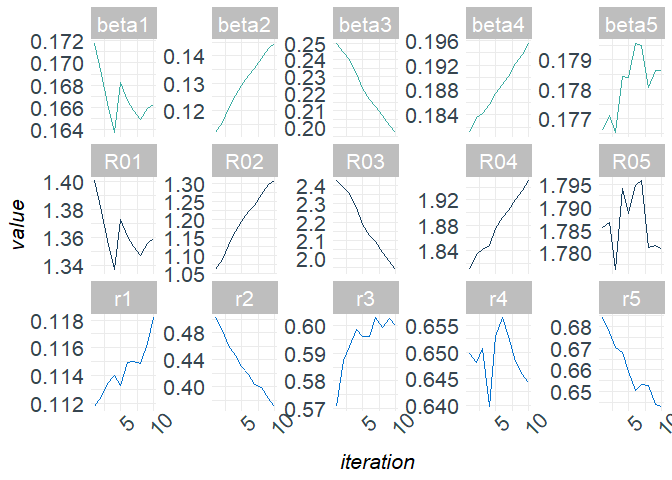
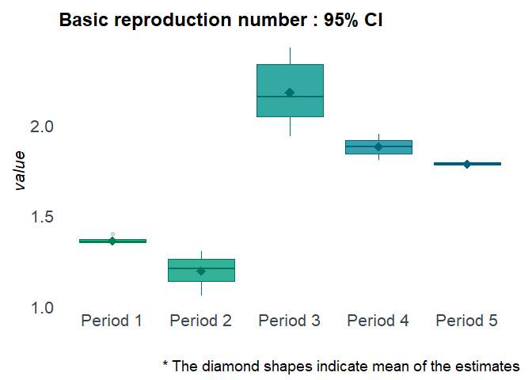
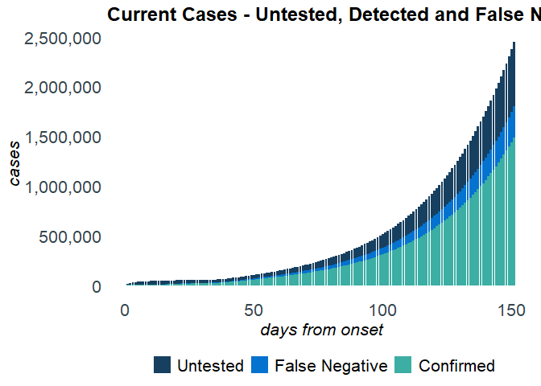

<!-- README.md is generated from README.Rmd. Please edit that file -->

# R package `SEIRfansy`

# Extended Susceptible-Exposed-Infected-Recovery Model

[](https://github.com/umich-biostatistics/SIERfansy)
[](https://github.com/umich-biostatistics/SEIRfansy)

## Overview

This `R` package fits Extended Susceptible-Exposed-Infected-Recovery
(SEIR) Models for handling high false negative rate and symptom based
administration of diagnostic tests.

## Installation

If the devtools package is not yet installed, install it first:

``` r
install.packages('devtools')
```

``` r
# install SEIRfansy from Github:
devtools::install_github('umich-biostatistics/SEIRfansy') 
```

Once installed, load the package:

``` r
library(SEIRfansy)
#> Registered S3 methods overwritten by 'car':
#>   method                          from
#>   influence.merMod                lme4
#>   cooks.distance.influence.merMod lme4
#>   dfbeta.influence.merMod         lme4
#>   dfbetas.influence.merMod        lme4
```

## Example Usage

For this example, we use the built-in package data set `covid19`, which
contains dailies and totals of cases, recoveries, and deaths from the
COVID-19 outbreak in India from January 30 to September 21 of 2020.

### Setup

You will need the `dplyr` package for this example.

``` r
library(dplyr)
#> 
#> Attaching package: 'dplyr'
#> The following objects are masked from 'package:stats':
#> 
#>     filter, lag
#> The following objects are masked from 'package:base':
#> 
#>     intersect, setdiff, setequal, union
```

Training data set:

For training data, we use cases from April 1 to June 30

``` r
train = covid19[which(covid19$Date == "01 April "):which(covid19$Date == "30 June "),]
```

Testing data set:

For testing data, we use cases from July 1 to July 31

``` r
test = covid19[which(covid19$Date == "01 July "):which(covid19$Date == "31 July "),]
```

Data format for multinomial and Poisson distribution:

``` r
train_multinom = 
  train %>% 
  rename(Confirmed = Daily.Confirmed, 
         Recovered = Daily.Recovered,
         Deceased = Daily.Deceased) %>%
  dplyr::select(Confirmed, Recovered, Deceased)

test_multinom = 
  test %>% 
  rename(Confirmed = Daily.Confirmed, 
         Recovered = Daily.Recovered,
         Deceased = Daily.Deceased) %>%
  dplyr::select(Confirmed, Recovered, Deceased)

train_pois = 
  train %>% 
  rename(Confirmed = Daily.Confirmed) %>%
  dplyr::select(Confirmed)
```

Initialize parameters:

``` r
N = 1341e6 # population size of India
data_initial = c(2059, 169, 58, 424, 9, 11)
pars_start = c(c(1,0.8,0.6,0.4,0.2), c(0.2,0.2,0.2,0.25,0.2))
phases = c(1,15,34,48,62)
```

## SEIRfansy()

If interest is in model estimation but not prediction, then use
`SEIRfansy()`. Otherwise, use `predict()` (see below).

``` r
?SEIRfansy
```

``` r
cov19est = SEIRfansy(data = train_multinom, init_pars = pars_start, 
                     data_init = data_initial, niter = 1e3, BurnIn = 1e2, 
                     model = "Multinomial", N = N, lambda = 1/(69.416 * 365), 
                     mu = 1/(69.416 * 365), period_start = phases, opt_num = 1, 
                     auto.initialize = TRUE, f = 0.15)
#> Finding MLE
#> 1 MLE run finished!
#>  
#> MLE estimates : 
#> beta = ( 0.18, 0.1, 0.25, 0.18, 0.18 )
#> r = ( 0.112, 0.531, 0.544, 0.65, 0.688 )
#>  
#> MCMC:
#> Iter 100  A = 0  :  0.1773 0.108 0.2492 0.1842 0.1755 0.1113 0.5079 0.5546 
#> 0.6511 0.6823
#> Iter 200  A = 3904.491  :  0.1738 0.1122 0.2474 0.1849 0.1759 0.1102 0.4859 
#> 0.5656 0.6495 0.6791
#> Iter 300  A = 0  :  0.1732 0.1169 0.2437 0.1864 0.175 0.1091 0.4639 0.5766 
#> 0.6368 0.6662
#> Iter 400  A = 109847.1  :  0.1714 0.121 0.2366 0.1848 0.1765 0.111 0.4464 
#> 0.5854 0.6351 0.6715
#> Iter 500  A = 0  :  0.1715 0.1248 0.2321 0.1836 0.1778 0.1095 0.4322 0.5924 
#> 0.6358 0.6609
#> Iter 600  A = 1.736969e+12  :  0.1697 0.1275 0.2263 0.1879 0.1785 0.1115 0.4216 
#> 0.5883 0.6396 0.6533
#> Iter 700  A = 0  :  0.1703 0.1313 0.218 0.1884 0.1784 0.1128 0.408 0.5923 
#> 0.6446 0.658
#> Iter 800  A = 0  :  0.1709 0.1351 0.2106 0.1927 0.179 0.1144 0.3899 0.5887 
#> 0.6335 0.6438
#> Iter 900  A = 0  :  0.1716 0.138 0.2068 0.1934 0.1789 0.1131 0.3869 0.5873 
#> 0.6359 0.6373
#> Iter 1000  A = 0  :  0.1705 0.1413 0.2031 0.193 0.1779 0.1141 0.3737 0.5837 
#> 0.6318 0.643
#> Iter 1100  A = 12231.21  :  0.1674 0.1452 0.1985 0.1945 0.1775 0.114 0.3667 
#> 0.5848 0.6358 0.6443
```

<!-- --><!-- -->

Inspect the results:

``` r
names(cov19est)
class(cov19est$mcmc_pars)
names(cov19est$plots)
```

Plot the results:

``` r
plot(cov19est, type = "trace")
```

<!-- -->

``` r
plot(cov19est, type = "boxplot")
```

<!-- -->

## SEIRfansy.predict()

If interest is in model estimation and prediction, then use `predict()`,
which first runs `SEIRfansy()` internally, and then predicts.

``` r
?SEIRfansy.predict
```

``` r
cov19pred = SEIRfansy.predict(data = train_multinom, init_pars = pars_start, 
                              data_init = data_initial, T_predict = 60, niter = 1e3, 
                              BurnIn = 1e2, data_test = test_multinom, model = "Multinomial", 
                              N = N, lambda = 1/(69.416 * 365), mu = 1/(69.416 * 365), 
                              period_start = phases, opt_num = 1, 
                              auto.initialize = TRUE, f = 0.15)
#> Estimating ... 
#>   
#> Finding MLE
#> 1 MLE run finished!
#>  
#> MLE estimates : 
#> beta = ( 0.18, 0.1, 0.25, 0.18, 0.18 )
#> r = ( 0.112, 0.531, 0.544, 0.65, 0.688 )
#>  
#> MCMC:
#> Iter 100  A = 0  :  0.1737 0.1092 0.2546 0.1799 0.1752 0.1114 0.5196 0.5645 
#> 0.6475 0.6827
#> Iter 200  A = 2.655551e+13  :  0.1717 0.1118 0.2497 0.1811 0.1766 0.1117 0.5024 
#> 0.5706 0.6498 0.6841
#> Iter 300  A = 0  :  0.169 0.1156 0.2445 0.1835 0.1771 0.1125 0.4838 0.5874 
#> 0.6481 0.6772
#> Iter 400  A = 0  :  0.1664 0.1206 0.2403 0.1842 0.1765 0.1134 0.4617 0.5925 
#> 0.6507 0.6702
#> Iter 500  A = 245558777490  :  0.1638 0.1254 0.232 0.1856 0.1784 0.114 0.446 
#> 0.5985 0.6397 0.6679
#> Iter 600  A = 2.7295  :  0.1682 0.1291 0.223 0.1874 0.1784 0.1132 0.4293 0.5962 
#> 0.6529 0.6592
#> Iter 700  A = 0  :  0.1666 0.1328 0.2166 0.189 0.1796 0.1149 0.4188 0.5961 
#> 0.6565 0.6504
#> Iter 800  A = 13.1469  :  0.1657 0.1354 0.2128 0.1903 0.1795 0.115 0.4033 
#> 0.6029 0.6529 0.6532
#> Iter 900  A = 0  :  0.165 0.1389 0.2072 0.1923 0.1781 0.1149 0.3985 0.5992 
#> 0.6483 0.6528
#> Iter 1000  A = 4e-04  :  0.1659 0.1426 0.2017 0.1938 0.1786 0.1163 0.382 0.6027 
#> 0.6457 0.6442
#> Iter 1100  A = 0  :  0.1662 0.1446 0.1972 0.1955 0.1786 0.1182 0.3701 0.5999 
#> 0.6443 0.6429
```

<!-- --><!-- -->

    #>  
    #> Predicting ...

<!-- --><!-- -->

Inspect the results:

``` r
names(cov19pred)
class(cov19pred$prediction)
class(cov19pred$mcmc_pars)
names(cov19pred$plots)
```

Plot the results:

``` r
plot(cov19pred, type = "trace")
```

<!-- -->

``` r
plot(cov19pred, type = "boxplot")
```

<!-- -->

``` r
plot(cov19pred, type = "panel")
```

<!-- -->

``` r
plot(cov19pred, type = "cases")
```

<!-- -->

### Current Suggested Citation
